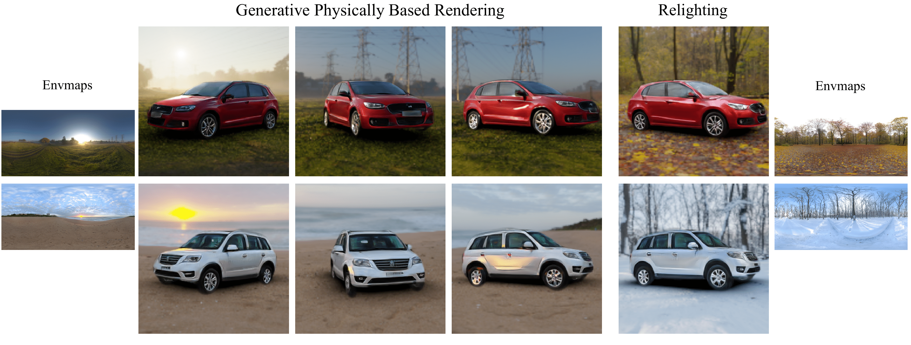
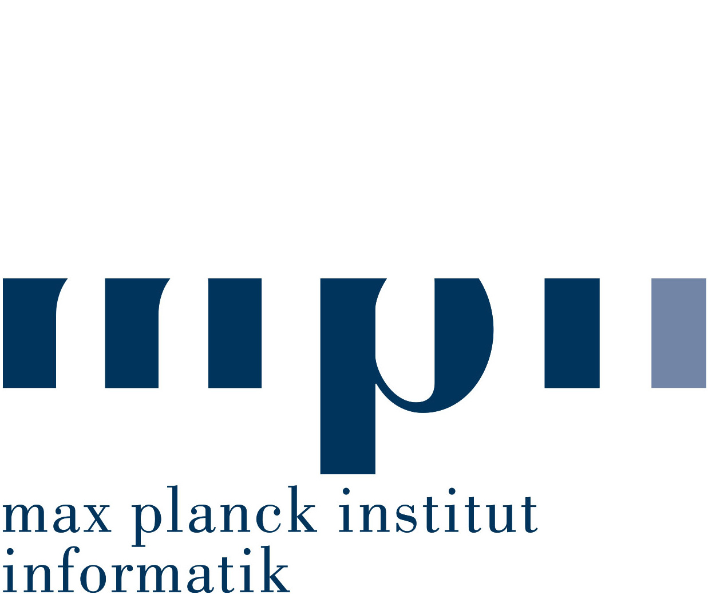
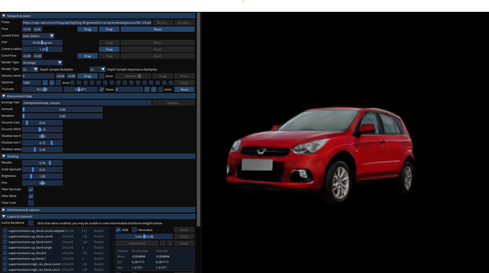

# Physically-Based Lighting for 3D Generative Models of Cars
Nicolás Violante, Alban Gauthier, Stavros Diolatzis, Thomas Leimkühler, George Drettakis

| [Webpage](https://repo-sam.inria.fr/fungraph/lighting-3d-generative-cars/) | [Full Paper](https://repo-sam.inria.fr/fungraph/lighting-3d-generative-cars/lighting_3D_generative_cars.pdf) | [Other GRAPHDECO Publications](http://www-sop.inria.fr/reves/publis/gdindex.php) | [FUNGRAPH project page](https://fungraph.inria.fr) |



<a href="https://www.inria.fr/"> </a>
<a href="https://univ-cotedazur.eu/"> </a>
<a href="https://www.intel.com"> </a> 
<a href="https://www.mpi-inf.mpg.de"> </a> 

<a href="https://team.inria.fr/graphdeco/"> </a>
## Abstract
*Recent work has demonstrated that Generative Adversarial Networks (GANs) can be trained to generate 3D content from 2D image collections, by synthesizing features for neural radiance field rendering. However, most such solutions generate radiance, with lighting entangled with materials. This results in unrealistic appearance, since lighting cannot be changed and view-dependent effects such as reflections do not move correctly with the viewpoint. In addition, many methods have difficulty for full, 360◦ rotations, since they are often designed for mainly front-facing scenes such as faces*

*We introduce a new 3D GAN framework that addresses these shortcomings, allowing multi-view coherent 360◦ viewing and at the same time relighting for objects with shiny reflections, which we exemplify using a car dataset. The success of our solution stems from three main contributions. First, we estimate initial camera poses for a dataset of car images, and then learn to refine the distribution of camera parameters while training the GAN. Second, we propose an efficient Image-Based Lighting model, that we use in a 3D GAN to generate disentangled reflectance, as opposed to the radiance synthesized in most previous work. The material is used for physically-based rendering with a dataset of environment maps. Third, we improve the 3D GAN architecture compared to previous work and design a careful training strategy that allows effective disentanglement. Our model is the first that generatea variety of 3D cars that are multi-view consistent and that can be relit interactively with any environment map*

## Citation
```
@Article{violante2024lighting_3D_cars,
      author       = {Violante, Nicolás and Gauthier, Alban, and Diolatzis, Stavros and Leimkühler, Thomas and Drettakis, George},
      title        = {Physically-Based Lighting for 3D Generative Models of Cars},
      journal      = {Computer Graphics Forum (Proceedings of the Eurographics Conference)},
      number       = {2},
      volume       = {43},
      month        = {April},
      year         = {2024},
      url          = {https://repo-sam.inria.fr/fungraph/lighting-3d-generative-cars/}
}
```

## Contents


- [Installation](#installation)
- [Visualization](#visualization)
- [Training](#training)
- [Evaluation](#evaluation)
- [Acknowledgements](#acknowledgements)


# Installation

```
conda env create -f environment.yml
conda activate gancars
```
Our pretrained model can be downloaded from [here](https://repo-sam.inria.fr/fungraph/lighting-3d-generative-cars/pretrained/gancars256-128.pkl). 

# Visualization

- Start an interactive session (click in `Recent` to load the pretrained model)
    ```
    python gancars/visualizer.py
    ```
    


- Generate a sequence of images with a 360 camera capture for multiple environment maps.

    ```
    python gancars/gen_samples_360cam.py  --outdir=<output dir> --network=<model pickle path> --envmaps_dir-=<envmap dir1, envmap dir2, etc> --seeds=<seed0, seed1, etc>
    ```

- Generate a sequence of images for a fixed position while doing a 360 rotation of the environment map for multiple environment maps.

    ```
    python gancars/gen_samples_360env.py  --outdir=<output dir> --network=<model pickle path> --envmaps_dir_=<envmap dir1, envmap dir2, etc> --seeds=<seed0, seed1, etc>
    ```

# Evaluation

- Evaluate multi-view inversion. We provide images of four different cars in `samples/ultivew_inversion_data` and a default environment map in `samples/envmap_sample`
    ```
    python gancars/run_inversion_multiview.py --network=<model pickle path> --data_dir=<multi-view data dir> --envmap_dir=<envmap dir> --outdir=<outdput dir>
    ```

- Evaluate relighting inversion. We provide images of four different cars in `samples/ultivew_inversion_data` and one default soft environment map in `samples/envmap_soft`
    ```
    python gancars/run_inversion_multiview.py --network=<model pickle path> --data_dir=<multi-view data dir> --envmap_dir=<envmap dir> --outdir=<outdput dir>
    ```

# Training
## Car Data Preparation
1. Download [CompCars](http://mmlab.ie.cuhk.edu.hk/datasets/comp_cars/) dataset.
2. Download pretrinaed checkpoints of [EgoNet](https://drive.google.com/file/d/1JsVzw7HMfchxOXoXgvWG1I_bPRD1ierE/view) and place them in `pose_estimation/checkpoints`. Checkpoints for [GroundedDINO](https://github.com/IDEA-Research/GroundingDINO/releases/download/v0.1.0-alpha/groundingdino_swint_ogc.pth) and [SAM](https://dl.fbaipublicfiles.com/segment_anything/sam_vit_h_4b8939.pth) can be downloaded manually but the pose estimation tool will download them automatically. The `pose_estimation/checkpoints` folder should have the following structure:
    ```
    pose_estimation
    |---checkpoints
        |---groundingdino_swint_ogc.pth
        |---HC.pth
        |---L.pth
        |---LS.npy
        |---sam_vit_h_4b8939.pth
    ```
3. Run pose estimation and background removal (can take more than 48 hours for the full dataset)
    ```
    python pose_estimation/run_pose_estimation.py --data=<data dir> --dest=<dest dir> 
    ```
## Environment Map Data Preparation
1. Download [Laval Outdoor Dataset](http://hdrdb.com/outdoor/) (optional).
2. Download environment maps from Polyhaven and iHDRI.
    ```
    python envmap_processing/download.py --polyhaven_dir=<PolyHaven data dir> ---ihdri_dir=<iHDRI data dir>
    ```
3. Download and extract [Filament Engine](https://github.com/google/filament) `.tgz` for your OS. This is used to compute irradiance maps for diffuse shading.
4. Create dataset. Also computes the irradiance map used for diffuse shading and apply exposure adjustment for Laval Dataset (if used).
    ```
    python envmap_processing\prepare_envmap_dataset.py --outdir=<output dir> --polyhaven_dir=<PolyHaven data dir> ---ihdri_dir=<iHDRI data dir> --laval_dir=<Laval data dir, optional> --cmgen_exe=<path to Filament's cmgen executable>
    ```
    Note: the `cmgen` executable can be found under the `bin` folder after extracting the `.tgz` file.
    
    The dataset should have the following structure:
    ```
    outdir
    |---00000
        |---img00000000
            |---img00000000_diffuse.hdr
            |---img00000000_specular.hdr
        |---img00000001
            |---img00000000_diffuse.hdr
            |---img00000000_specular.hdr
        |---...
    |---00001
        |---...
    ```
## Launch Training
```
python train.py --data=<data dir> --envmaps=<envmaps dir> --gpus=<number of GPUs> --batch=<batch size> --config=configs/compcars_ibl_ada.json

```
The training configuration is specified in `configs/compcars_ibl_ada.json`. For more configuration details, please refer to the original [EG3D guide](https://github.com/NVlabs/eg3d/blob/main/docs/training_guide.md). 

# Acknowledgements


This research was funded by the ERC Advanced grant FUNGRAPH No 788065. The authors are grateful to Adobe for generous donations, NVIDIA for a hardware donation, the OPAL infrastructure from Université Côte d'Azur and for the HPC/AI resources from GENCI-IDRIS (Grants 2022-AD011013898 and AD011013898R1). We thank A. Tewari and A. Bousseau for insightful comments on a draft. 

This repository is based on [EG3D](https://github.com/NVlabs/eg3d). We thank the authors for releasing their code.